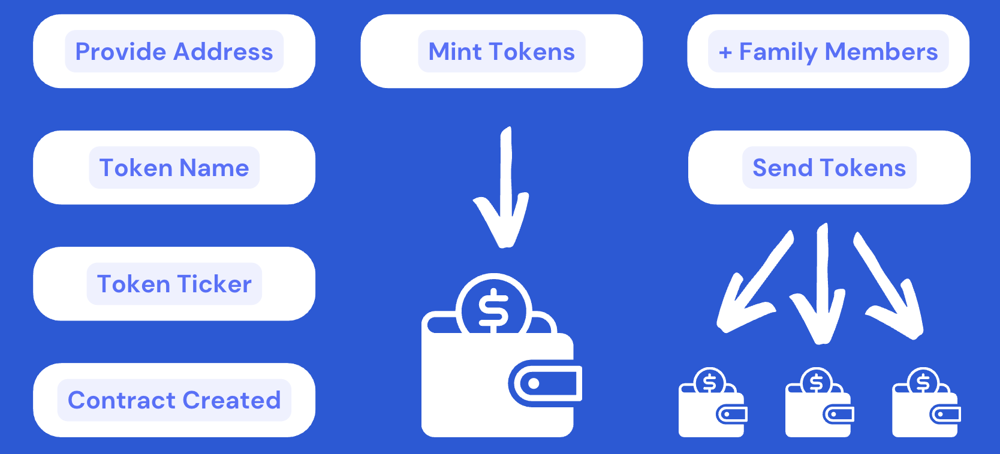

# FamCash – Safe crypto for families.

## Executive Summary

Cryptocurrency is a young, misunderstood technology that is shaping parts of our digital future. However, most families today are quite fearful of scams and hesitant to use this tech. FamCash aims to help with this problem. The objective of this project is to use Ethereum smart contracts to onboard family units into the crypto space by allowing them to easily create private tokens for use among themselves only.


## How It Works

A parent accesses the FamCash web or mobile app to begin the process. They connect their wallet and provide a name and ticker symbol for the token they want to create for family use. A new FamCash contract is created with their provided information and they're assigned ownership of it. From there, they can mint up to one million tokens, add Parents and Members, and begin sending tokens. 



The difference between Parents and Members is that Parents can mint new tokens while Members cannot. This is so Parents have control over their tokens and can specify who in their families can or cannot mint them.


## Safety

The main concern people have about using cryptocurrency is safety. FamCash is designed with privacy and protection from scammers in mind. To accomplish this, each family token contract is created their own private contract with safeguards in the code so that no one else in the world can use to mint or send tokens. Only family members designated by the contract owner, the Parent who created it, can interact with it. This protects everyone in their family, so they can learn how to use crypto in a safe, sandboxed environment that's free from outsiders.

```
// OnlyFamily Modifier - Limits sending to family members
    modifier onlyFamily() {
    require(hasRole(PARENT, msg.sender) || hasRole(MEMBER, msg.sender),
    "Only family members can send tokens.");
    _;
}
```


## FamCash & FamCashDuo

- contractOwner - The wallet address of the parent creating the contract.
- tokenName - The name of the token set by the contract owner.
- tokenTicker - The ticker symbol of the token set by the contract owner.
- Role: Parent - A family member with authority to mint, send, and add/remove others. 
- Role: Member - A family member with authority to send only.
- Function: mint - Creates the specified number of new tokens. (Up to 1,000,000)
- Function: send - Sends the specified number of tokens to the specified recipient.
- Function: addParent - Adds a wallet address and grants it the Parent & Member roles.
- Function: addMember - Adds a wallet address and grants it the Member role.


## FamCash Factory Contract Functions
- NewFamCash - Creates a new FamCash contract by taking in user-specified values to set as contractOwner, tokenName, and tokenTicker. Then, adds each new contract to the empty array.

---

Built with 💜 using [RemixIDE](https://remix.ethereum.org/#lang=en&optimize=false&runs=200&evmVersion=null&version=soljson-v0.8.18+commit.87f61d96.js)

---
